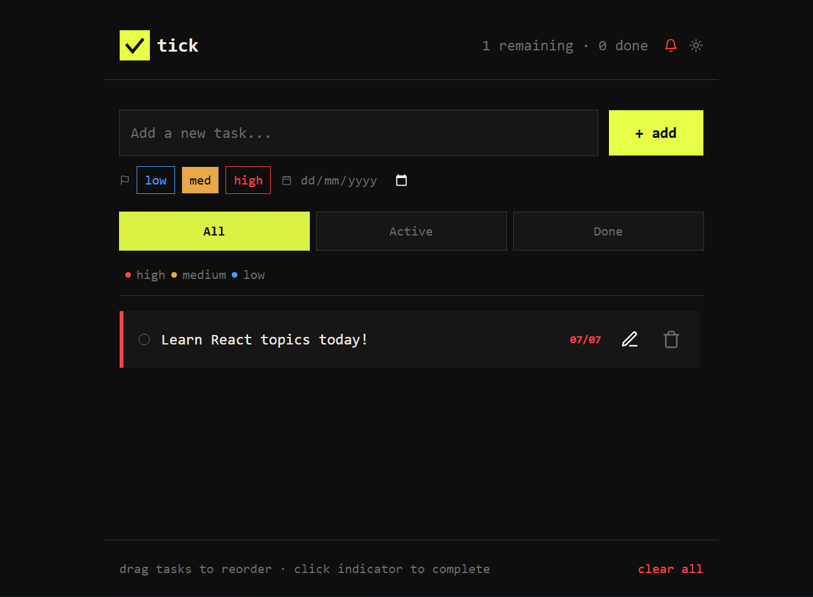

<div align="center">

<svg width="90" height="90" viewBox="0 0 28 28" xmlns="http://www.w3.org/2000/svg">
  <rect width="28" height="28" fill="#e8ff47"/>
  <polyline points="7,14 12,20 21,9"
    stroke="#0e0e0e"
    stroke-width="2.8"
    stroke-linecap="square"
    stroke-linejoin="miter"
    fill="none"/>
</svg>

# tick


</div>

---

## 📸 Preview

<p align="center">
  
</p>

---

# 📖 Overview

**tick** is an ultra-minimal, high-performance task management application designed for speed and clarity.

Instead of cluttering your workspace with multiple pages, **tick** keeps everything inside one focused viewport. Your headers, priority trackers, task inputs, and footer remain fixed while only the task matrix scrolls independently.

The application is lightweight, responsive, and works entirely in your browser without requiring a backend.

---

# ✨ Features

- ⚡ Persistent Synchronization using **localStorage**
- 📌 Native HTML5 Drag-and-Drop Reordering
- 🔊 Loud Square-Wave Deadline Audio Alerts
- 🔔 Browser Push Notifications
- 📱 Responsive Mobile-Friendly Layout
- 📋 Matrix Task Container
- 🎯 Fixed Workspace Layout
- 💾 Automatic Local Saving
- ✏️ Edit Existing Tasks
- 🗑️ Delete Confirmation Modal
- ⏰ Deadline Tracking

---

# 🛠 Technology Stack

| Technology | Purpose |
|------------|---------|
| React 18+ | UI Development |
| Vite | Build Tool |
| Tailwind CSS | Styling |
| React Hooks | State Management |
| localStorage API | Data Persistence |
| Notification API | Browser Notifications |
| Web Audio API | Audio Alerts |
| HTML5 Drag & Drop API | Task Reordering |

---

# 📂 Project Structure

```text
tick
│
├── public
│   ├── favicon.svg
│   └── tick_preview.webp.png
│
├── src
│   ├── assets
│   │   └── Icons.jsx
│   │
│   ├── components
│   │   ├── ConfirmModal.jsx
│   │   ├── EditModal.jsx
│   │   ├── Header.jsx
│   │   ├── TaskInput.jsx
│   │   ├── TaskItem.jsx
│   │   └── TaskList.jsx
│   │
│   ├── App.jsx
│   ├── App.css
│   ├── index.css
│   └── main.jsx
│
├── logo.svg
├── package.json
├── vite.config.js
├── eslint.config.js
├── index.html
└── README.md
```

---

# 🚀 Installation

Clone the repository.

```bash
git clone https://github.com/akvr000/tick-task-manager.git
```

Move into the project folder.

```bash
cd tick
```

Install dependencies.

```bash
npm install
```

Start the development server.

```bash
npm run dev
```

Visit:

```
http://localhost:5173
```

---

# 📦 Production

Build the application.

```bash
npm run build
```

Preview the production build.

```bash
npm run preview
```

---

# 💾 Data Storage

All tasks are automatically saved using the browser's **localStorage API**.

No backend or database is required.

---

# 🔔 Notifications

With notification permission enabled, **tick** sends native browser desktop notifications whenever a task reaches or exceeds its deadline.

---

# 🔊 Audio Alerts

The application generates a loud square-wave beep using the **Web Audio API**, eliminating the need for external audio files.

---

# 📱 Responsive Design

Optimized for:

- 💻 Desktop
- 🖥 Laptop
- 📱 Mobile
- 📟 Tablet

Only the task matrix scrolls while the surrounding interface remains fixed.

---

# 🎯 Design Philosophy

> **Stay focused. Stay organized. Stay productive.**

**tick** removes unnecessary distractions so you can concentrate on completing your tasks efficiently.

---

# 🤝 Contributing

Contributions are always welcome.

1. Fork the repository.
2. Create a new feature branch.
3. Commit your changes.
4. Push your branch.
5. Open a Pull Request.

---

# 📄 License

Licensed under the **MIT License**.

---

<div align="center">

Made with ❤️ using React, Vite & Tailwind CSS

⭐ If you like this project, don't forget to leave a star!

</div>